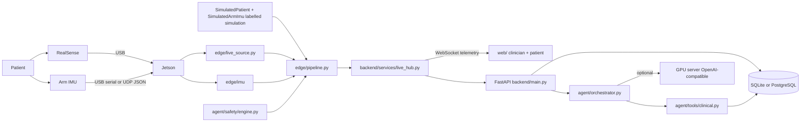

# Architecture

## Runtime contract

One hospital platform process (`backend.main`) plus one optional original patient station (`backend.server`). Measurement source is selected at process start (`REHABAI_SOURCE=simulation|live`). Live mode never falls back to synthetic values. A live camera never receives a simulated IMU. The LLM is optional; ROM, reps and BLOCK safety continue without it.

The original station at port 8765 still uses `backend/engine.py` and a schematic arm. The hospital studio uses `edge/` geometry, exercise state machines and WebSocket telemetry.

## Edge pipeline

1. Capture RGB + aligned depth, or an explicit `SimulatedPatient`.
2. Read an arm IMU packet (simulated, UDP JSON, or serial), or leave IMU off.
3. `PoseEstimator.predict(frame)` (MediaPipe or YOLO adapter).
4. Depth neighbourhood + deprojection to 3D (`edge/depth/projection.py`).
5. EMA smoothing (`edge/depth/filtering.py`).
6. Deterministic angles (`edge/biomechanics/angles.py`) — not an LLM. Reps use camera ROM.
7. Complementary fusion of camera angle + IMU gyro rate. Disagreement is WARN, not a diagnosis.
8. Time-domain IMU quality features (mean/std/range of accel and gyro norms, smoothness).
9. Exercise state machine (`edge/exercises/state_machine.py`).
10. Compensation events and `evaluate_safety`.
11. Compact telemetry several times per second. Raw video is not written to the database.

## IMU packet

JSON line over UDP (`REHABAI_IMU_TRANSPORT=udp`) or serial:

`{"placement":"arm","ax":0.1,"ay":0.2,"az":9.7,"gx":1.2,"gy":2.0,"gz":30.1}`

Accel in m/s², gyro in deg/s. Strap the unit on the lateral upper arm. Wrist is optional later (`REHABAI_IMU_PLACEMENTS`).

## API (hospital platform)

JWT roles: ADMIN, DOCTOR, PHYSIOTHERAPIST, PATIENT. Patients see only their record. Physiotherapists and doctors see assigned patients. Admins manage staff and may view records but cannot start treatment sessions.

Principal routes live under `/api/`: `auth/login`, `patients`, `sessions`, `agent/query`, `alerts`, `reports`, `exercises`, `plans`, WebSocket `/api/ws/sessions/{id}`.

## Agent

One supervisor. Tools query SQLAlchemy; the language model never receives a database connection or raw video. If `LLM_BASE_URL` is unset, a deterministic summary is produced from tool JSON.

## Storage

Completed session telemetry may be written to `storage/patients/{id}/sessions/{session}/telemetry.json` when recording consent is granted. PostgreSQL holds structured records only.

## Not verified in this workspace

RealSense streaming, Jetson latency, pose model accuracy, depth-to-angle error versus goniometer, IMU-to-camera calibration, and any clinical outcome.
