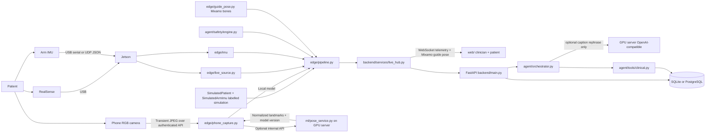

# Architecture

## Runtime contract

One hospital platform process (`backend.main`) plus one optional original patient station (`backend.server`). RealSense measurement source is selected at process start (`REHABAI_SOURCE=simulation|live`); each phone session explicitly requests `capture=phone`. Live and phone modes never fall back to synthetic values. A live camera never receives a simulated IMU. The LLM is optional; ROM, reps and BLOCK safety continue without it. The optional GPU pose service is independent of the optional LLM server.

The original station at port 8765 still uses `backend/engine.py` and a schematic arm. The hospital studio uses `edge/` geometry, exercise state machines and WebSocket telemetry.

## Edge pipeline

1. Capture RGB + aligned depth, or an explicit `SimulatedPatient`.
2. Read an arm IMU packet (simulated, UDP JSON, or serial), or leave IMU off.
3. `PoseEstimator.predict(frame)` (MediaPipe or YOLO adapter).
4. Depth neighbourhood + deprojection to 3D (`edge/depth/projection.py`).
5. EMA smoothing (`edge/depth/filtering.py`).
6. Deterministic angles (`edge/biomechanics/angles.py`) — not an LLM. Reps use camera ROM.
7. Complementary fusion of camera angle + IMU gyro rate. Disagreement is WARN, not a diagnosis.
8. Time-domain IMU quality features (mean/std/range of accel and gyro norms, smoothness).
9. Exercise state machine (`edge/exercises/state_machine.py`).
10. Compensation events and `evaluate_safety`.
11. Compact telemetry several times per second. Raw video is not written to the database.
12. Mixamo guide pose (`edge/guide_pose.py`) — upright demo arm from the same telemetry. The LLM never sets bone angles. Optional GPU/LLM may only rephrase the on-screen cue (`POST /api/guide/caption`). Drop a Mixamo-rigged `web/models/guide.glb` later; do not vendor photogrammetry of a real person.

## Phone measurement contract

The consumer UI captures front-camera RGB at a bounded rate and sends authenticated JPEG frames to `POST /api/sessions/{id}/phone-frame`. The backend rejects non-JPEG, oversized, over-resolution, and too-frequent frames. Frames are decoded for inference and discarded; telemetry stores landmarks, confidence, source, model version, repetitions and safety events.

Phone RGB has no RealSense depth. Calibration uses upper-body framing instead of fabricated metres, and telemetry is labelled `phone_rgb_2d` / `monocular_2d_projection`. Current phone tracking is restricted to frontal-plane abduction/elevation. Phone accuracy, camera placement, movement plane and device variation require separate validation before clinical use.

## IMU packet

JSON line over UDP (`REHABAI_IMU_TRANSPORT=udp`) or serial:

`{"placement":"arm","ax":0.1,"ay":0.2,"az":9.7,"gx":1.2,"gy":2.0,"gz":30.1}`

Accel in m/s², gyro in deg/s. Strap the unit on the lateral upper arm. Wrist is optional later (`REHABAI_IMU_PLACEMENTS`).

## API (hospital platform)

JWT roles: ADMIN, DOCTOR, PHYSIOTHERAPIST, PATIENT. Patients see only their record. Physiotherapists and doctors see assigned patients. Admins manage staff and may view records but cannot start treatment sessions.

Principal routes live under `/api/`: `auth/login`, `patients`, `sessions`, `guide/caption`, `agent/query`, `voice/agent`, `alerts`, `reports`, `exercises`, `plans`, WebSocket `/api/ws/sessions/{id}`.

## Voice questionnaire and export

Questionnaire and Talk-dock audio follows a separate optional path: browser WAV → authenticated FastAPI (`/api/intake/transcribe` or `/api/voice/agent`) → Sarvam Saaras STT, then ElevenLabs Scribe, then Windows Speech → deterministic intake parser or live Claude coach. Text-to-speech prefers Sarvam Bulbul speaker `shubh` (Subh), then ElevenLabs, then the browser. Provider failure does not stop deterministic measurement or the score-button intake.

Claude live replies receive only sanitized session metrics (scene, source, safety, angles, reps, cue). It does not receive patient identifiers, raw audio, camera frames, or history. A numeric score that was not found by the deterministic parser is rejected rather than inferred by the LLM. `safety == BLOCK` always speaks a stop line.

Patient exports are generated inside the backend after the same access check used by the dashboard. JSON and Excel contain structured records and source labels. Recordings remain separate files and are never embedded in the database export.

## Agent

One supervisor. Tools query SQLAlchemy; the language model never receives a database connection or raw video. If `LLM_BASE_URL` is unset, a deterministic summary is produced from tool JSON.

## Storage

Completed session telemetry may be written to `storage/patients/{id}/sessions/{session}/telemetry.json` when recording consent is granted. PostgreSQL holds structured records only.

## Not verified in this workspace

RealSense streaming, Jetson latency, phone or RealSense pose model accuracy, phone-angle and depth-to-angle error versus goniometer, IMU-to-camera calibration, physical APK camera flow, and any clinical outcome.
